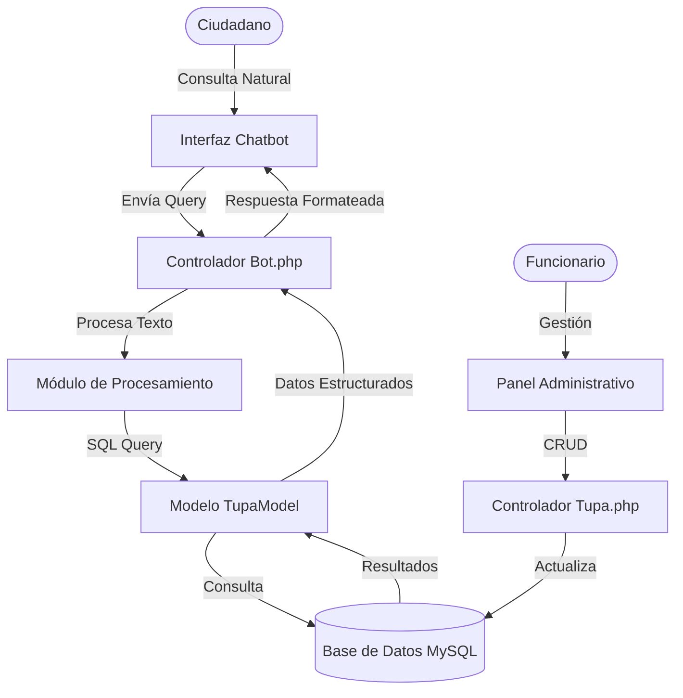

# MANUAL DEL SISTEMA DE GESTIÓN ADMINISTRATIVA E INTELIGENCIA ARTIFICIAL "LEONARDITO"

**Versión:** 1.0.0  
**Fecha:** 18 de Febrero, 2026  
**Proyecto:** Chatbot TUPA & Panel Administrativo  

---

## 📋 Control de Versiones

| Versión | Fecha | Autor | Descripción del Cambio |
| :--- | :--- | :--- | :--- |
| 1.0.0 | 18/02/2026 | Equipo de Desarrollo | Versión inicial del documento para entrega a Jefatura. |

---

## 📑 Tabla de Contenidos

1.  [Introducción](#1-introducción)
2.  [Arquitectura del Sistema](#2-arquitectura-del-sistema)
3.  [Manual de Usuario (Ciudadano)](#3-manual-de-usuario-ciudadano)
4.  [Manual Administrativo (Funcionario)](#4-manual-administrativo-funcionario)
5.  [Instalación y Despliegue](#5-instalación-y-despliegue)
6.  [Anexos](#6-anexos)

---

## 1. Introducción

### 1.1 Propósito del Documento
El presente documento tiene como objetivo describir detalladamente el funcionamiento, operación y arquitectura del sistema **"Leonardito"**, una solución tecnológica diseñada para optimizar la atención al ciudadano mediante el uso de Inteligencia Artificial para consultas sobre el Texto Único de Procedimientos Administrativos (TUPA).

### 1.2 Alcance
El sistema abarca dos módulos principales:
1.  **Frontend (Chatbot):** Interfaz pública donde los ciudadanos realizan consultas en lenguaje natural.
2.  **Backend (Panel Administrativo):** Interfaz privada para que los funcionarios gestionen (creen, editen, eliminen) la información de los trámites.

### 1.3 Stack Tecnológico
El sistema está construido sobre tecnologías robustas y escalables:

*   **Lenguaje Base:** PHP 8.1+
*   **Framework:** CodeIgniter 4 (MVC)
*   **Base de Datos:** MySQL 8.0
*   **Inteligencia:** Algoritmos de Búsqueda Semántica y Procesamiento de Lenguaje Natural (NLP).
*   **Infraestructura:** Compatible con Apache/Nginx (Laragon/XAMPP).

---

## 2. Arquitectura del Sistema

El sistema sigue el patrón de diseño **Modelo-Vista-Controlador (MVC)**, asegurando la separación de la lógica de negocio, la interfaz de usuario y los datos.

### 2.1 Diagrama de Flujo de Datos

---

## 3. Manual de Usuario (Ciudadano)

### 3.1 Acceso al Sistema
Para acceder al sistema, el ciudadano debe ingresar a la URL proporcionada por la institución (ej. `http://leonardito.test`).

### 3.2 Interfaz del Chatbot
La interfaz ha sido diseñada pensando en la simplicidad.

> **[ESPACIO PARA CAPTURA DE PANTALLA]**
> *Instrucción: Inserte aquí una captura de la pantalla principal del Chatbot.*
> **Figura 1: Pantalla Principal del Asistente Virtual**

**Componentes:**
1.  **Área de Chat:** Muestra el historial de la conversación.
2.  **Campo de Texto:** Permite escribir preguntas como *"¿Cuáles son los requisitos para matrimonio?"*.
3.  **Botón Enviar:** Procesa la consulta.

### 3.3 Ejemplos de Interacción
El sistema reconoce intenciones complejas. Ejemplos válidos:
*   *"Necesito sacar una licencia de funcionamiento"*
*   *"¿Cuánto cuesta el trámite de divorcio?"*
*   *"Ver el TUPA completo"*

---

## 4. Manual Administrativo (Funcionario)

### 4.1 Ingreso al Panel
El personal autorizado puede acceder al módulo de gestión a través de `/admin/tupa`.

### 4.2 Listado de Trámites
Esta vista permite visualizar todos los procedimientos registrados actualmente en el sistema.

> **[ESPACIO PARA CAPTURA DE PANTALLA]**
> *Instrucción: Inserte aquí captura de /admin/tupa mostrando la tabla de trámites.*
> **Figura 2: Panel de Gestión de Trámites**

**Acciones Disponibles:**
*   **Editar:** Modificar requisitos, costos o plazos de un trámite existente.
*   **Eliminar:** Dar de baja un procedimiento obsoleto.
*   **Agregar Nuevo:** Registrar un nuevo procedimiento TUPA.

### 4.3 Registrar Nuevo Trámite
Al hacer clic en "Nuevo Trámite", se despliega el formulario de registro.

> **[ESPACIO PARA CAPTURA DE PANTALLA]**
> *Instrucción: Inserte aquí captura del formulario de creación.*
> **Figura 3: Formulario de Registro**

**Campos Críticos:**
*   **Denominación:** Nombre exacto del procedimiento.
*   **Descripción:** Detalle amigable para el chatbot.
*   **Requisitos:** Lista detallada (soporta formato PDF).
*   **Costo:** Valor monetario del trámite.

---

## 5. Instalación y Despliegue

### 5.1 Requisitos Previos
*   Servidor con soporte PHP 8.1.
*   Extensiones habilitadas: `intl`, `mbstring`.
*   Acceso a línea de comandos (Terminal/CMD).

### 5.2 Pasos de Instalación
1.  Clonar repositorio: `git clone https://github.com/HugoDC3009/leonardito.git`
2.  Instalar dependencias: `composer install`
3.  Configurar variables de entorno en archivo `.env`.
4.  Ejecutar migraciones: `php spark migrate`
5.  Iniciar servicio: `php spark serve`

---

## 6. Anexos

### 6.1 Glosario de Términos
*   **TUPA:** Texto Único de Procedimientos Administrativos.
*   **CRUD:** Create, Read, Update, Delete (Operaciones básicas de base de datos).
*   **NLP:** Natural Language Processing (Procesamiento de Lenguaje Natural).
